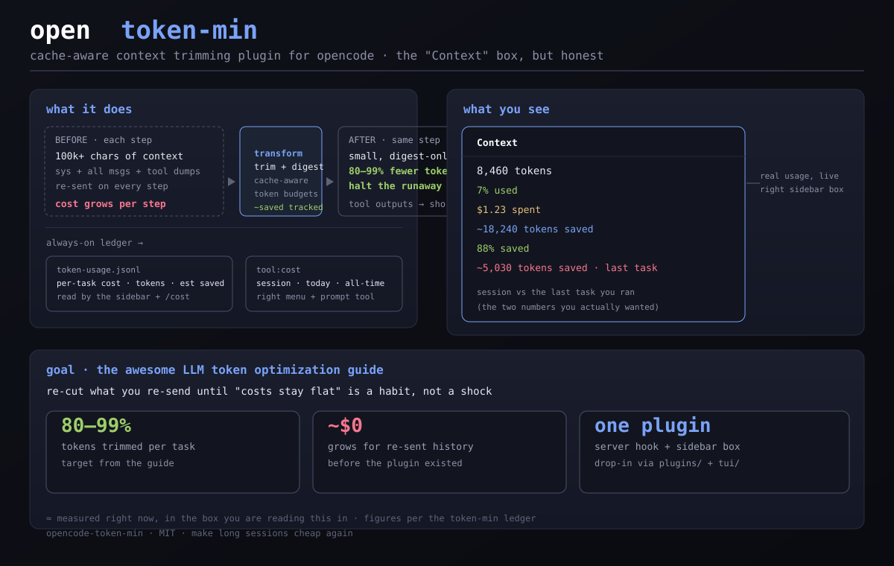

<div align="center">

# 🪓 opencode-token-min

**A cache-aware context trimming plugin for opencode.**

*"Long sessions stop costing money while you watch."*



```
    ┌──────────────────────────────────────────────────────┐
    │              opencode-token-min                       │
    │                                                        │
    │   server hook ──▶ trim + digest each step's context   │
    │   cache-aware budgets keep the whole session lean     │
    │   every task logged: cost · tokens · est. saved       │
    │   right-sidebar Context box now tells the truth       │
    │                                                        │
    │                        /╳\  MIT · one plugin          │
    └──────────────────────────────────────────────────────┘
```

**License** [MIT](LICENSE) · **Branch** `main`

</div>

---

**opencode-token-min** is a single-purpose plugin that stops the
runaway-token grind in long interactive sessions. Every step in a chat re-sends
your whole context to the model — history, tool dumps, cached prefixes — and by
step 30 that is a lot of money per keystroke. This plugin rewrites the context
before it ships: it **trims** history down to configurable per-role budgets,
**digests** huge tool outputs into short summaries, and **respects prompt
caching** (no cache breaks, so skipped-in tokens stay skipped-in). It tracks
what it kept vs. trimmed for every step, records a per-task **ledger**, and the
TUI plugin turns that into the Context box you actually wanted: tokens, % used,
$ spent, total saved, % saved — and now **saved on the last task**, not a
blurry lifetime total.

The leading goal, per the awesome LLM token-optimization guide: **cut the
re-sent-context bill by 80–99%.** That is ambitious, measurable, and exactly
what long sessions need.

---

## ✨ Why this exists

Most cost is not the model. It is *your own conversation* being re-invoiced on
every single step:

1. **You re-pay for all of history, every step.** A 20-step task with 50k
   tokens of context isn't 50k tokens — it's ~1M tokens by the end. That's the
   cost you actually watch happen.
2. **Tool dumps dominate.** `git status`, file reads, 2,000-line logs all go
   into the prompt verbatim, then get re-sent forever. Trimming them is the
   single biggest lever.
3. **The sidebar lies.** opencode's built-in Context box shows only the *last*
   step's tokens. You can't see the trend, the burn, or what was saved — so the
   problem stays invisible until the invoice.
4. **Fixable, locally, with one hook.** The `experimental.chat.messages.transform`
   hook runs before every model call. Token-min is that hook, plus a ledger, plus
   an honest sidebar.

---

## 🚀 Quick start

```bash
mkdir -p ~/.config/opencode/plugins ~/.config/opencode/tui

# server plugin (trim + digest + ledger + /cost tool)
cp plugins/token-min.ts   ~/.config/opencode/plugins/

# TUI plugin (the honest Context box on the right)
cp tui/token-min.tsx      ~/.config/opencode/tui/

# config file for sidebar (registers token-min, renders the honest Context box)
cp tui.json               ~/.config/opencode/tui.json
# note: if you already have a tui.json (e.g. other TUI plugins), merge the
# "plugin" arrays instead of overwriting it.

# restart opencode, or just /tui --dev to hot-reload the sidebar
```

**Zero config.** Sanely conservative defaults. Everything is tunable via the
constants at the top of `plugins/token-min.ts`:

| Constant | Default | Meaning |
| --- | --- | --- |
| `MODE` | `"auto"` | `auto` (default) = trim + digest every step. `watch` = measure only (safe). `trim` = same as auto. `cached` = trims + widens budgets unconditionally |
| `MAX_USER` / `MAX_ASSISTANT` / `MAX_TOOL` | `12 / 12 / 12` | max messages per role kept in the tail |
| `MAX_TOTAL` | `30` | total messages kept (history + tail) |
| `MAX_TOTAL_CACHED` | `60` | tail cap when the session has an active cache |
| `CACHED_MULT` | `2` | multiplier applied to per-role budgets once a cache is confirmed |
| `PRESERVE_FIRST` | `3` | instructions/system messages never trimmed |
| `MIN_KEEP` | `2` | floor regardless of budgets |
| `OLD_MULT` | `2` | loosen budgets while cache state is unknown |
| `CHARS_PER_TOKEN` | `4` | chars÷this ≈ tokens for saved estimates |
| `KEEP_TAIL_MSGS` | `4` | recent tool parts skipped by digesting |
| `TOOL_DIGEST_BYTES` | `4000` | output limit before a tool part becomes a digest |
| `TOOL_DIGEST_HEAD` / `TOOL_DIGEST_TAIL` | `800 / 800` | chars kept at each end when digesting |

The default `auto` mode trims and digests from the very first install. If you'd
rather *measure first*, set `MODE = "watch"` — it only records `~saved` numbers
without touching a single token. Sessions that confirm an active cache switch
to `cached` budgets (`MAX_TOTAL_CACHED` / `CACHED_MULT`): keeping more of the
warm prefix intact is cheaper than forcing a rewrite, so trimming steps aside.

## 🛡 Quiet mode

Set `TOKEN_MIN_LOG=1` (or `true`) to enable per-step console output. By
default the plugin is quiet — `LOG` is opt-in, so nothing prints unless you ask.
The ledger (`token-usage.jsonl`) is always written regardless. (Output appears
in the TUI status area above the chat field when enabled.)

---

## 🧠 How it works

```
                  every step's messages
      ┌──────────────────────────────────────────────┐
      │                                              ▼
      │   experimental.chat.messages.transform  ──▶  trimMessages()
      │       │                                        │
      │       │   per-role budgets + total cap         │ preserve first N
      │       │   (loosened while cache unknown)       ▼
      │       │   digest oversized tool outputs   ──▶  keep-then-drop
      │       │                                        │
      │       ▼                                        ▼
      │    token-usage.jsonl ◀──── step-finish ──▶ ledger append
      │        │  per-task rows: cost · tokens · estSaved
      │        ▼
      │    sidebar Context box (tui/token-min.tsx)
      │        context · tokens · % used · $ · saved · % saved · last task
      └──────────────────────────────────────────────────────────────
```

* **Measure first.** Every step records chars-before vs. chars-after and
  converts the difference to an estimated token saving (`chars/4 ≈ tokens`),
  plus cache-read tokens when the provider reports them.
* **Cache-aware.** While the cache state of a session is unknown the budgets are
  doubled (`OLD_MULT`), so trimming can't silently break a warm cache. Once the
  session confirms an active cache the per-role budgets widen again (`CACHED_MULT`)
  and the tail targets `MAX_TOTAL_CACHED`: keeping the warm prefix intact beats
  forcing a rewrite, since re-sending cached tokens is far cheaper than new ones.
* **Tool outputs get digested, not deleted.** Oversized outputs are rewritten
  to a short digest (`[digested N-byte tool output → summary]`), keeping the
  tail of the conversation *useful* instead of just small.
* **Per-task ledger.** One JSONL row per step, tagged with the originating user
  message (`taskID`), so *"how much did that last attempt cost and save"* is a
  real number — not the whole-session ballpark.
* **The sidebar tells the truth.** Context / tokens / % used / \$ spent /
  ~saved / % saved, then **~N tokens saved · last task** — the two numbers that
  matter mid-session, from the ledger, not from API internals.
* **Ask the agent.** The `cost` tool prints session / today / all-time totals
  in chat; a `/cost`-style right-menu item is planned.

---

## 📊 What you get

| In the sidebar | What it means |
| --- | --- |
| `8,460 tokens` | tokens in the *last* step, as the API reports them |
| `7% used` | side panel heading as stock opencode |
| `$1.23 spent` | cost of the last step (if the provider reports it) |
| `~18,240 tokens saved` | cumulative est. tokens not re-sent, from the ledger |
| `88% saved` | saved ÷ (saved + sent), the honest ratio |
| `~5,030 tokens saved · last task` | savings from the *most recent task only* |

```bash
$ opencode /tui --dev     # hot-reload the sidebar while you tweak
```

---

## ⚠️ Caveats

* **Estimates, not invoices.** trimmed savings use a chars→token heuristic and
  a tool-digest heuristic; cache-read tokens come straight from the provider.
  Numbers are for *watching the trend*, not for accounting.
* **The default (`auto`) trims from day one.** If you want to *measure first*,
  set `MODE = "watch"` — nothing is touched until you opt in with `trim` /
  `cached`.
* **Cache safety is measured, not guaranteed** — the plugin errs on the side of
  *smaller* context, which is never wrong on cost.

---

## 🔍 Inspecting the ledger

```bash
tail -5 ~/.local/share/opencode/token-usage.jsonl
```

One row per step-finish: `ts, sessionID, taskID, messageID, model, cost, tokens
{input, output, reasoning, cacheRead, cacheWrite, estSaved, beforeTok, afterTok}`.
`estSaved` (≈ chars-saved ÷ 4) is conservative and floored at 0; `beforeTok` /
`afterTok` are estimates of the prompt size before vs. after trimming. Sum
`estSaved` per `taskID` and you have exactly what a long session really burned.

---

## 🛠 Development

```bash
bun build plugins/token-min.ts --outdir /tmp/token-min-build   # syntax check
# then: run a long session → inspect the ledger (MODE="watch" to observe first)
```

---

## License

[MIT](LICENSE) — do whatever, keep the name.